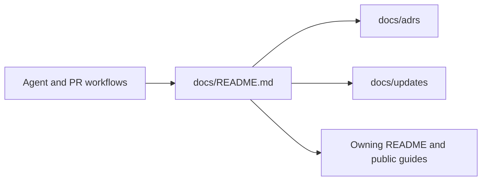

# Consistent documentation and agent workflows

PR: Pending

## Intent of the change

Make durable decisions and complete change records discoverable and consistently
maintained across Tilde repositories throughout implementation and PR review.

## Architecture changes

Governing decision: [0001-repository-documentation-convention](../../adrs/0001-repository-documentation-convention.md).
Runtime architecture is unchanged by the documentation-convention changes.

## Summarized changes

- Standardized directories, templates, and documentation maintenance instructions.
- Connected agent instructions and PR, pre-commit, architecture, and documentation skills.
- Preserved existing decision history and repaired moved local references.
- Validation: local Markdown links, balanced code fences, required update sections, changed skill frontmatter, and `git diff --check` passed.
- Prepared from the fetched default branch in an isolated worktree; unrelated checkout changes are excluded.
- Relocated the shared Mintlify submodule to `public-docs/`, preserving its commit, and updated the generator default, Makefile, README, and provider skills together.
- Focused validation: `go test ./internal/docgen ./tools/generatedocs` passed. External provider tests and catalogue generation were not run because their behavior did not change.
- Publication and PR numbering are pending; no application deployment is required.

## Critical to apply

yes

Existing checkouts must run `git submodule sync` and
`git submodule update --init --recursive public-docs` after updating. Custom
automation that refers to the shared documentation at `docs/` must use
`public-docs/` or set `DOCS_REPO_DIR`. No application migration or secret change
is required. Related repositories adopt the documentation convention independently.
